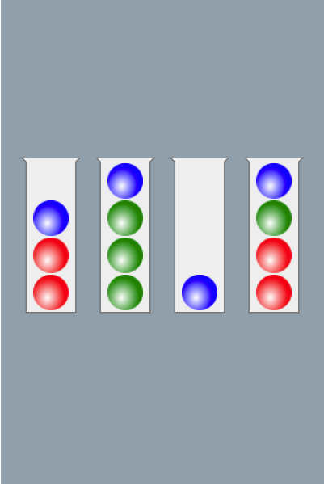

# Ball Sort

## HOW TO PLAY:

- Tap any tube to move the ball on top of the tube
- Tap another tube to place the ball in that tube
- The rule is that you can only move a ball on top of another ball if both of them have the same color and the tube you want to move into has enough space
- Try to sort the colored balls in the tubes until all balls with the same color stay in the same tube
